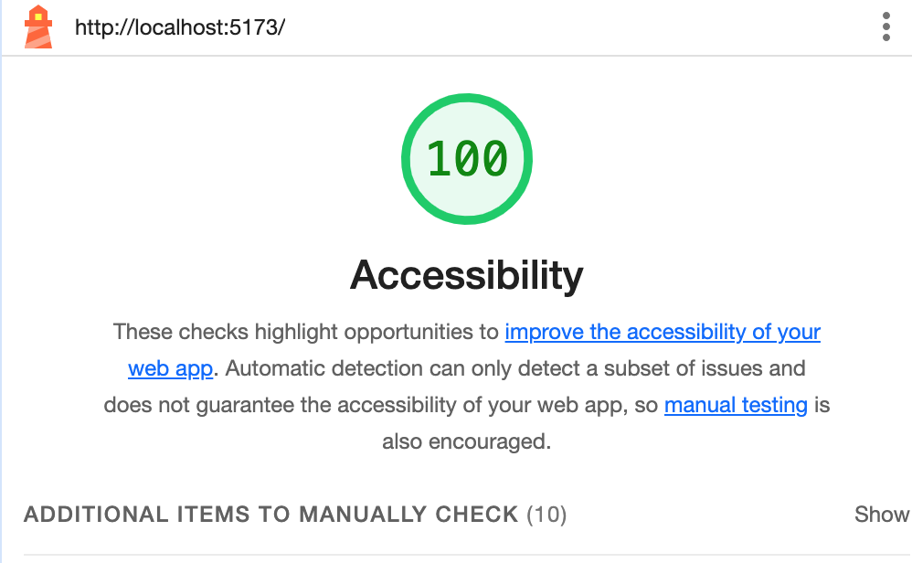
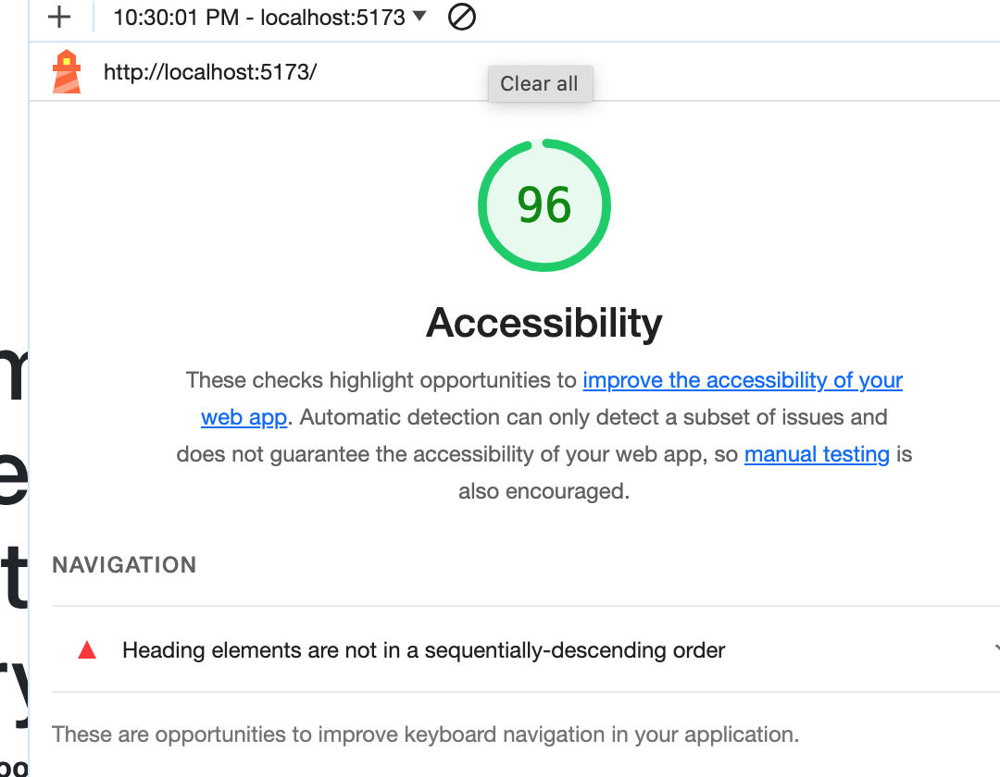

# React + Vite

This template provides a minimal setup to get React working in Vite with HMR and some ESLint rules.

Currently, two official plugins are available:

- [@vitejs/plugin-react](https://github.com/vitejs/vite-plugin-react/blob/main/packages/plugin-react/README.md) uses [Babel](https://babeljs.io/) for Fast Refresh
- [@vitejs/plugin-react-swc](https://github.com/vitejs/vite-plugin-react-swc) uses [SWC](https://swc.rs/) for Fast Refresh

Time Estimate
Number and name of feature: Feature #1: Display Images

Estimate of time needed to complete: 2 hrs
Start time: 3:08pm
Finish time: 5:20pm
Actual time needed to complete: 1 hr

Number and name of feature: Feature #2: Allow Users to Favorite Individual Beasts

Estimate of time needed to complete: 2 hrs
Start time: 6:00pm
Finish time: 8:30pm
Actual time needed to complete: 15 minutes

Number and name of feature: Feature #3: Bootstrap

Estimate of time needed to complete: 3 hrs
Start time: 8:45pm
Finish time: wasn't able to finish, I faced some code challenges
Actual time needed to complete: 2 hrs

# Day3

Number and name of feature: __#4__Display a Modal___

Estimate of time needed to complete: _2 hrs____

Start time: __3pm___

Finish time: __10:30 pm___

Actual time needed to complete: __1 hrs___